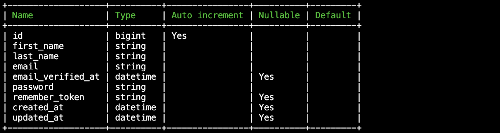

# Eloquent schema viewer

Eloquent schema viewer is is a small package for **Laravel** applications that let's you view the database table schema
for your eloquent models.

## Installation

Install the package via composer:

```
composer require --dev niclas-timm/eloquent-schema-viewer
```

## Usage

Once the package is installed, you can use it to print your eloquent model schemas to the terminal:

```
php artisan eloquent-schema-viewer:view --model="User"
```

This command will print the schema of the user model to the terminal like so:


## Options

| Option | Description                                            | Example         |
|--------|--------------------------------------------------------|-----------------|
| model  | The name of the model you want to view the schema for. | --model="User"  |
| table  | The name of the table you want to view the schema for. | --table="users" |

One of those two options must be set. Otherwise, the command will fail.

## Aliases

Since the command `eloquent-schema-viewer:view` is quite long, we configured some shorter aliases:
`esv:view` and `esv:view-schema` do the same thing as `eloquent-schema-viewer:view`.